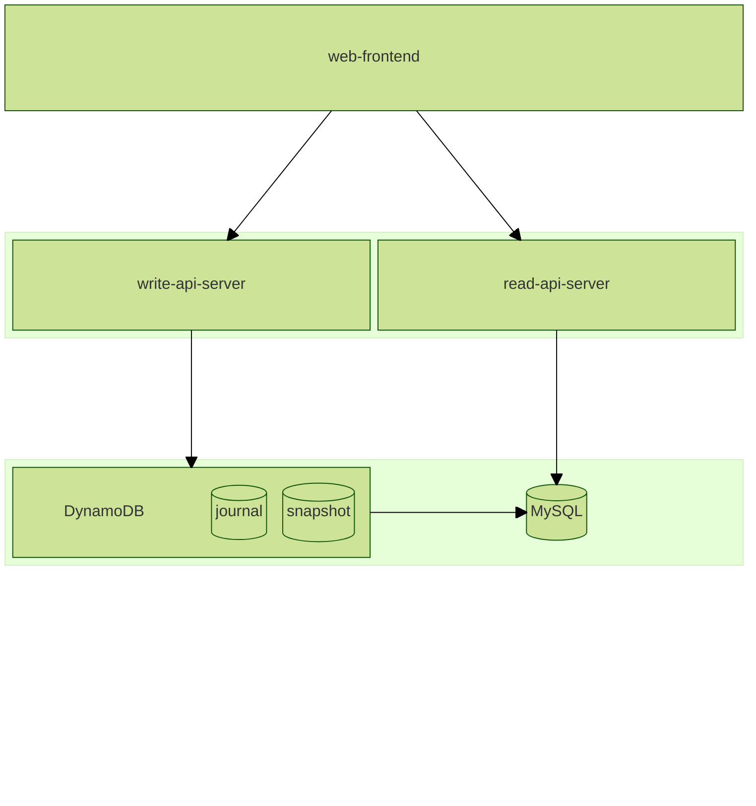

# CQRS + ES サンプルプロジェクト

## 環境構築

git hooks で lefthook を使うように設定する

```sh
lefthook install
```

## 動作確認

### curl コマンド

1. 予約情報の登録

```sh
curl -X POST http://localhost:8080/api/reservation \
  --cookie "userId=test-user-id" \
  -H "Content-Type: application/json" \
  -d '{"tableId": "test-table-id"}'
```

1. 予約情報の参照

```sh
curl http://localhost:3080/reservations
```

### Gauge による e2e

[`web-frontend`](./web-frontend/README.md) が起動している状態で実行する

```sh
cd specs/web

npm run test
```

### docker compose

1. 各プロジェクトで `docker build` を実施する

- [`read-api-server` > `README.md`](./read-api-server/README.md)
- [`read-model-updater` > `README.md`](./read-model-updater/README.md)
- [`write-api-server` > `README.md`](./write-api-server/README.md)

1. docker compose を立ち上げる

```sh
docker compose up
```

### kubernetes

1. 各プロジェクトで `docker build` と `Preparing for Kubernetes` を実施する

- [`read-api-server` > `README.md`](./read-api-server/README.md)
- [`read-model-updater` > `README.md`](./read-model-updater/README.md)
- [`write-api-server` > `README.md`](./write-api-server/README.md)

1. minikube を起動する

```sh
minikube start --driver=docker
minikube mount ${PWD}/write-api-server/scripts:/scripts
minikube mount ${PWD}/read-api-server/database:/database
minikube tunnel
```

1. kubernetes マニフェストを適用する

```sh
kubectl apply -f ./kubernetes/namespace.yml
kubectl apply -f ./kubernetes/read-model-data-store.yml
kubectl apply -f ./kubernetes/write-model-data-store.yml
kubectl apply -f ./kubernetes/read-model-updater.yml
kubectl apply -f ./kubernetes/read-api-server.yml
kubectl apply -f ./kubernetes/write-api-server.yml
```

#### 停止

```sh
kubectl delete -f ./kubernetes/read-api-server.yml
kubectl delete -f ./kubernetes/write-api-server.yml
kubectl delete -f ./kubernetes/read-model-updater.yml
kubectl delete -f ./kubernetes/read-model-data-store.yml
kubectl delete -f ./kubernetes/write-model-data-store.yml
kubectl delete -f ./kubernetes/namespace.yml
```

## リポジトリ構成

本リポジトリは [CQRS + ES](https://zenn.dev/kuramapommel/articles/self-study_actor-model-using-akka#cqrs-%2B-es) 構成の実装例です.

```bash
.
└── cqrs-es-example/
    ├── read-api-server/ # read model
    ├── read-model-updater/ # read model updater
    ├── specs/ # Gauge による仕様
    ├── web-frontend/ # web フロントエンド
    └── write-api-server/ # write model
```


